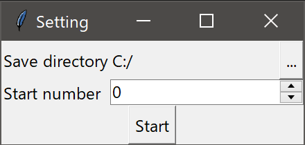
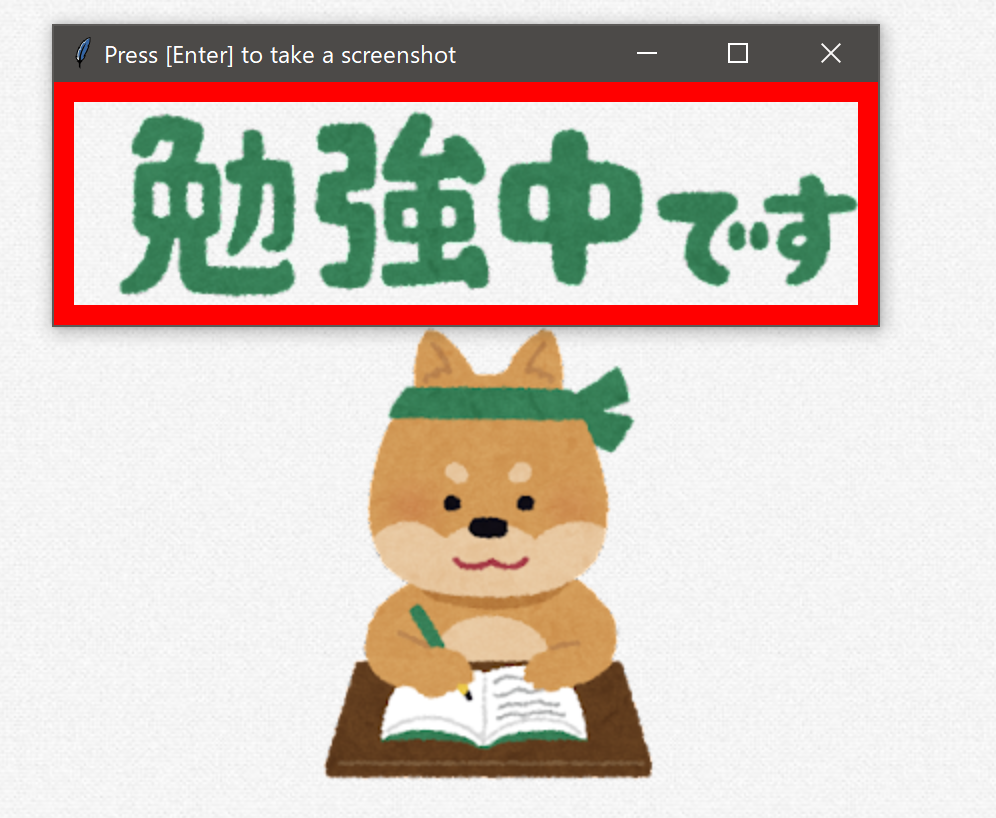
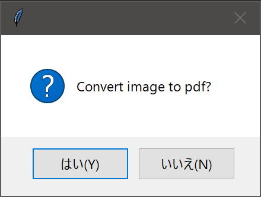

# Screenshot-to-PDF
## Overview
- You can take screenshots of a specified area of the screen repeatedly by pressing the Enter key.
- You can convert all the images into a single PDF file.

## Usage
### Launch
```console
$ python screenshot.py
```

### Setting

- You can change the directory where images are saved.
- You can change the starting number of images.
    - Images are saved in the format of "000.png", "001.png", and so on.

### Screenshot

- The area in the red frame will be screenshot.
- You can change the area as you want.

Press Enter on the screen above to save the following image:


### Conversion to PDF

- When you close the window, this dialog will appear.
- If you select "Yes", `output.pdf` will be generated.

### Note
- If there are any unnecessary images among the saved images, delete them and execute the following:
    ```console
    $ python png2pdf.py
    ```
    - A dialog box will appear. Select the directory where the you saved images.
    

## Required External Libraries
- `Pillow`
- `img2pdf`
